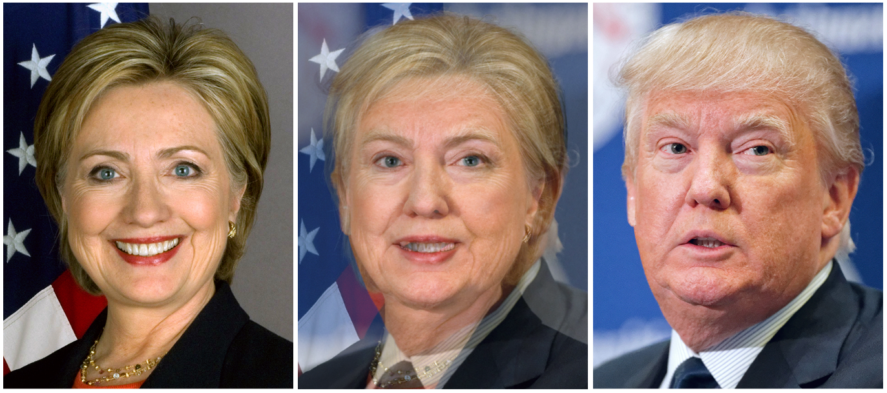
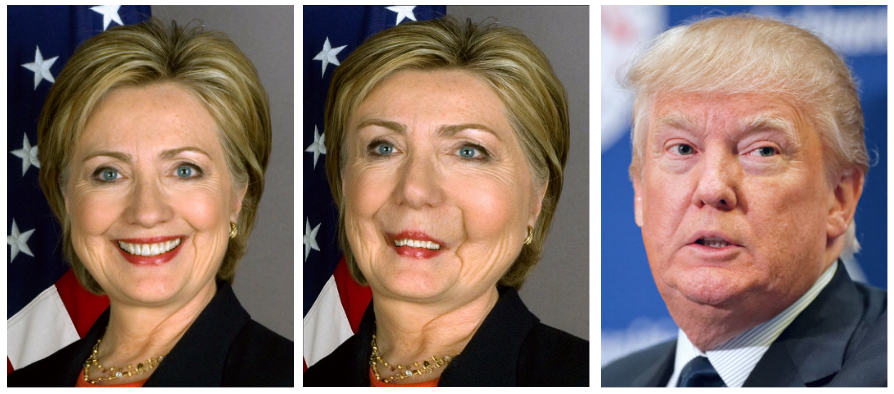
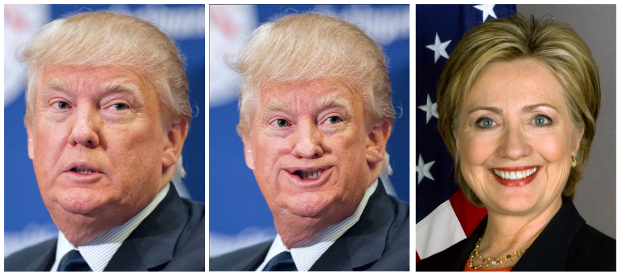
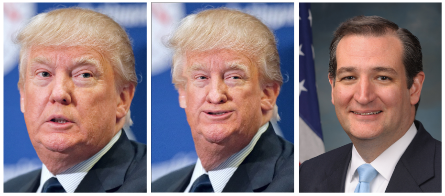
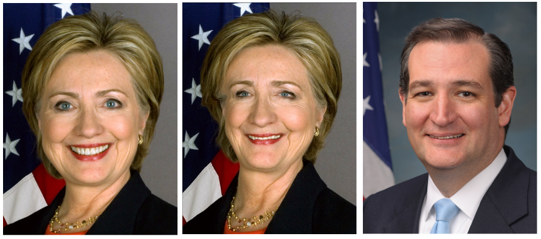
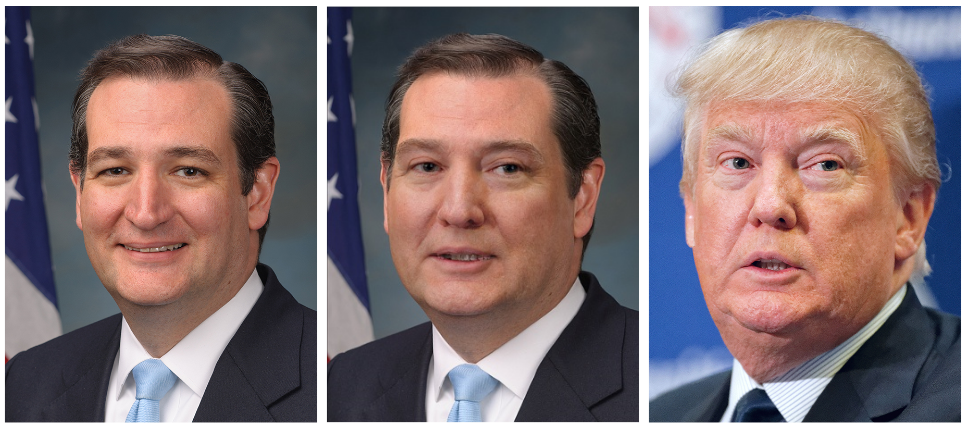
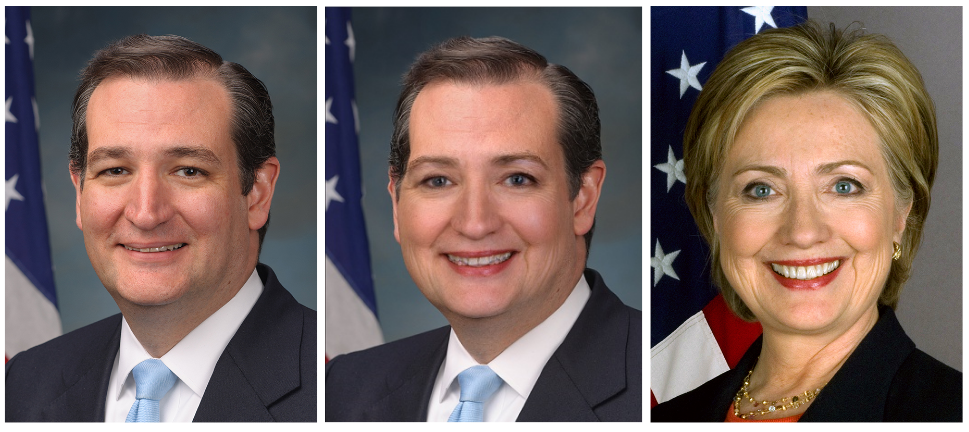
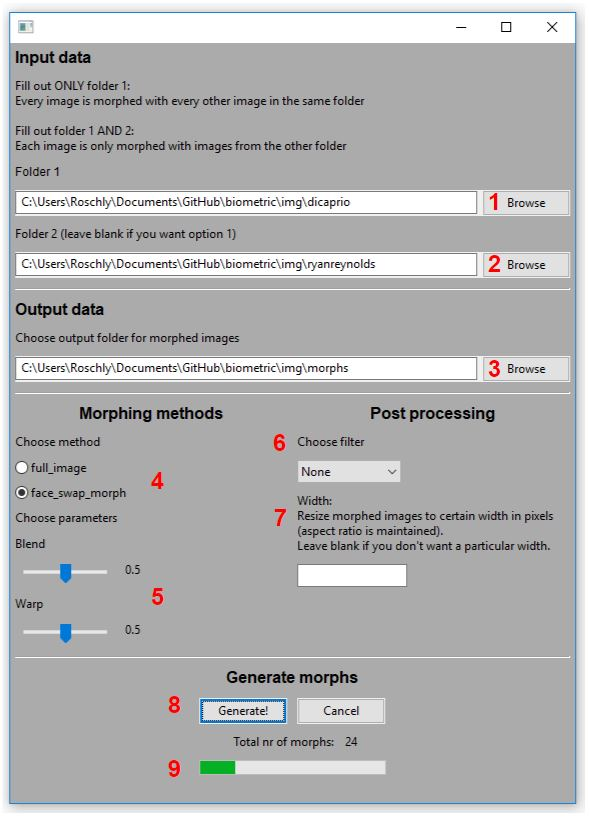
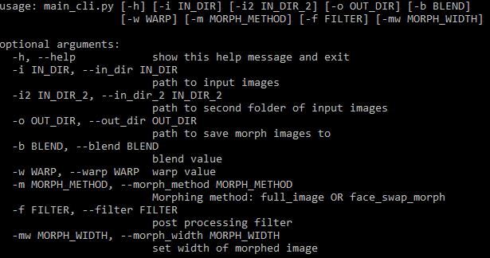

# Face-Morph Generation
Project for a course on Biometric Systems at the Technical University of Denmark. 
For more details see: report.pdf.

Code and theory are adopted from some excellent online tutorials on the topic:
- https://www.learnopencv.com/face-morph-using-opencv-cpp-python/
- https://www.learnopencv.com/face-swap-using-opencv-c-python/
- https://www.pyimagesearch.com/2017/04/17/real-time-facial-landmark-detection-opencv-python-dlib/

## Info

This is a Face-Morph Generation tool written in Python. It has a simple GUI and command-line interface. 
It takes a folder of images and morphs together pairs of images.

It implements two morphing methods:
- Full image (entire images are morphed directly)
- Face swap morph (the facial region of an entire morph, is seamlessly cloned onto one of the contributing images)

Two parameters control the morphing process:
- Blend: The contributing ratio of pixel values from each original image, in the final morph (range: 0.0 - 1.0)
- Warp: The contributing ratio of facial features/form from each original image, in the final morph (range: 0.0 - 1.0)

## How to run
...

## Results
See more results in the folder: morphed_results

### Full image morphing
#### blend=0.5, warp=0.5
Eyes and facial features are alinged, but otherwise a horrible morph.

### Face swap morphing
#### blend=0.0, warp=1.0
Keep all of left image's pixel values, but warp it to the facial form of the right image. Resulting morph in the middle.

#### blend=0.5, warp=0.5
A more realistic morph, with each image contributing half of both pixel values and facial form.

## GUI/CLI

## Known issues
- Artifacts around lips in some images. Probably a bug or rounding error
- Code not optimized!
